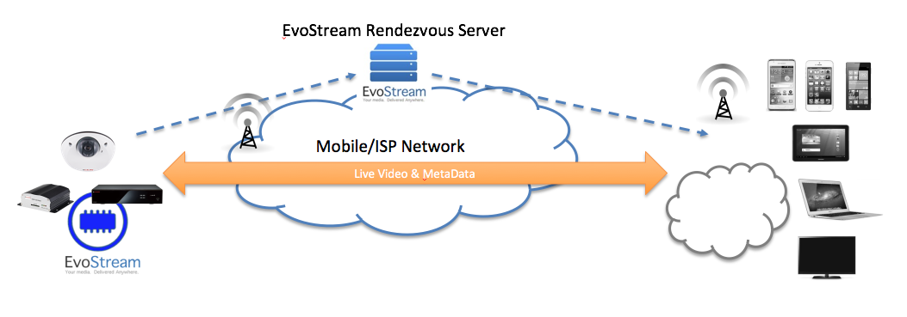

**WebRTC**(web reat-time communication)は、フリーでオープンプロジェクトでブラウザやモバイル・アプリケーションにシンプルなAPIでReal-Time Communication (RTC)機能を提供します。

WebRTCは非常にパワフルで最先端の技術かつ標準規格であり、デスクトップおよびモバイルブラウザの両方で使用可能なプラグインを必要としないAPI群です。メジャーなブラウザベンダーに着実にサポートされつつあります。

**WebRTC**イニシアチブはGoogle, Mozilla, Operaなどからサポートされているプロジェクトです。


## ピアツーピア

EMSはHTML5ブラウザおよびWebRTCをサポートするデバイスに対しダイレクトpeeringをサポートします。EMSは、WebRTCチャンネルを介して低遅延(秒単位以下)にH.264ビデオおよびAACオーディオをHTML5プレーヤーに配信します。WebRTC接続ではTCP TURNを使用することもできます。

ストリーム映像の元(たとえば監視カメラ)とエンドクライエント間でダイレクトにストリーミング配信を行わせることができ、ライブストリーミングサービスにおける大きなコスト要因（帯域コスト）を削減できます




カメラやウェアラブル機器その他のストリーム生成装置にEMSがインストールされ実行されている場合
ピアツーピアを実現できます。ピアツーピアのワークフローは以下のようなものです:


1. EMSが**EvoStream Rendezvous Server** (ERS)と通信できるように設定。EMSはERSとの通信を保ちつつpeerリクエストを待ちます。また特定の"Room"が設定されています。

2. WebRTCに対応したブラウザ／アプリが(ERSが提供またはユーザ指定の)Webサーバーに接続し、EvoStreamが提供するJavaScript Peeringコードを含むプレーヤーページをダウンロードします。


3. ブラウザは下記の設定済みのJavaScriptを読み込みます。

   - ERSのIPアドレス情報
   - 接続すべき"Room"情報

4. ブラウザはERSに接続し、"Room"に入るリクエストを送ります。

5. EMS(カメラ上の)およびブラウザ間でERS接続を通してpeering情報がやりとりされます

6. peering情報をつかって、EMS-ブラウザ間でpeer接続が確立され、ストリーミングが始まります。
   ​

  EvoStreamはEvoStream Rendezvous Serverを**52.6.14.61:4545**でホストしています
  プレーヤーは[ココ](ers.evostream.com:5050/demov2/evoplayers.html)をクリック
  このサーバーはテストや開発用途で使用できます。次のようなAPIコマンドをつかってEMSとともに使用できます。

```
startWebRTC ersIP=52.6.14.61 ersPort=3535 roomID=YourRoom
```

**NOTE:**

- パブリックERSですので、多くの方々が使用する可能性があります
- RoomIDがユニークなもので無い場合、意図しないストリームを受信したり、他人があなたのストリームを受信したりする場合があります。
- 常時使用可能とは限りません

実運用でピアツーピアシステムを用意したい場合は、専用のERSを用意するか、またはEvoStreamに専用ERSの準備を依頼できるかご相談ください。


