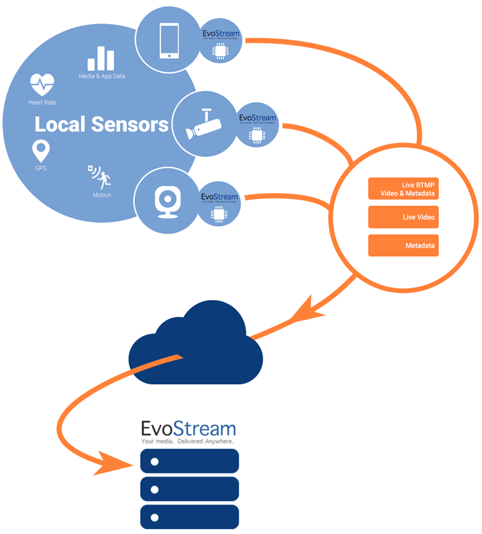
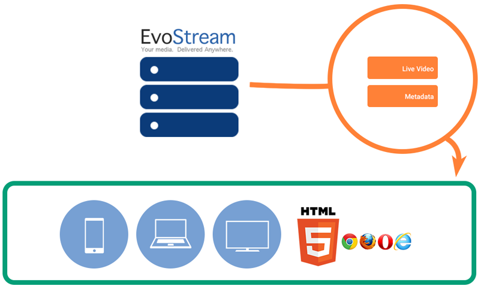

メタデータはデータについてのデータです。本文書のケースではストリームに関するデータと言えます。EMSはこのようなデータはどんなものでも(位置情報、画像(サムネール)、心拍数データ等など)インジェストや配信に対応しています。入力フォーマットは現状JSONが使われていますが、必要であればそれにかぎらず追加できます。こうしたメタデータをプレーヤーや他のEMSエンドポイントに送信することができます。

Metadata Outbound PushやMetadata Ingestといったメタデータの送受信に **Web Sockets Metadata Acceptor** を使用します。


## データのインジェストと集約化




EMSは、メタデータが統合されたライブRTMPストリームとどうようにメタデータを受けることができます。メタデータ受信方法としてはTCP accpetor経由およびwebsockets経由の２種類があります。


TCPおよびwebsocket acceptorはデフォルトで有効となっており、config.luaファイルを編集することでカスタマイズ可能です:

```
acceptors =
{
    -- 中略
    -- JSONMETA
    {
	   ip="0.0.0.0",
	   port=8100,
	   --streamname="test",
	   protocol="inboundJsonMeta",
    },
    -- WebSockets JSON Metadata
    {
        ip="0.0.0.0",
        port=8210,
        protocol="wsJsonMeta",
        -- streamname="~0~0~0~"
    },
    -- WebSockets JSON Metadata over SSL
    {
       ip="0.0.0.0",
	  port=8433,
	  protocol="wssJsonMeta",
	  -- streamname="~0~0~0~"
	  sslKey="C:\\EvoStream\\config\\server.key",
	  sslCert="C:\\EvoStream\\config\\server.cert",
    },
    -- 以下略
},
```

**解説:**

​	ip - サービスのIP。 0.0.0.0はすべてのインターフェースですべてのIPを意味します。

​	port - サービスがlistenするポート番号

​	protocol - ip:portの組み合わせにより扱われるプロトコル・スタック

​	streamname - メタデータが送信されるストリーム名、disableの場合はすべてのincomingストリームにマッチします

​	sslKey- 使用するsslへのパス

​	sslCert - 使用するssl証明書へのパス


`streamname`パラメータはオプションです。デフォルトはすべてのincomingストリームにマッチです。


メタデータを受信するとEMS Metadata Managerはメタデータを保存し、RTMPストリームに含めることができます。


## Metadataの配信



EMSはメタデータ送信に２種のメカニズムを使用できます。ひとつはクライエントが手動クエリーを投げ、EMSからのメタデータをポーリングするというものです。下記のようなコマンドです:


**Metadataの取得:**

```
getMetadata localStreamName=test
```

上記のコマンドは"_test_"ストリームに関連するメタデータを返します。


**Metadataプッシュ:**

２番目のメカニズムは、TCP接続経由でメタデータ更新を送るというものです。この場合受け側のエンドポイントがJSONフォーマットの入力メタデータのパースができる必要があります。次のようなコマンドになります:


```
pushMetadata localStreamName=test ip=192.168.2.1 port=8110
```

上記コマンドは更新されたメタデータを_192.168.2.1_でポート_8110_をlistenしているサーバーにプッシュします。

メタデータの送受信のこの他のメカニズムとしてwebsocketを介する方法がとれます。metadata websocket acceptorに接続するクライエントはEMSにメタデータを送信したり、EMSからメタデータ更新を受信したりすることができます。

詳しくは [getMetadata](api_getMetadata.html) および [pushMetadata](api_pushMetadata.html) APIを参照してください。


```
ws://host:port/streamname
```

GETフォーマットをつかってwebsocketチャンネルをopenします:

`streamname` 部分の指定はconfig.luaファイル内のacceptor定義に優先します

マッチしたJSONメタデータはテキストとして届きます。JSONメタデータの入力にはWS.send()を使用してください

最小限のメタデータページのサンプル:

```
<script>
    var ws= new WebSocket("ws://myems:8210/");
    ws.onmessage= function (msg) {
        console.log(msg.data);
    }
    Function doSend() {
        var x={fred:{wife:"Wilma",friend:"Barney"}};
        ws.send(JSON.stringify(x));
    }
</script>
<button onclick="doSend();">SEND</button>
```

FMP4プレーヤー用のWeb Sockets acceptorは`config.lua`内に定義されています。

```
acceptors =
{
    -- WebSockets FMP4 Fetch
    {
        ip="0.0.0.0",
        port=8410,
        protocol="inboundWSFMP4",
    },
},
```

上記ではoutbound FMP4 acceptorが定義されています。"inbound"と記述されているのは、Web Socket connectorがinboundだからです。

```
ws://host:port/streamname

```

接続にはWeb Socket “GET”コールが使われます。

*streamname* はEMSにプルされたストリームのローカルストリーム名です。

FMP4プレーヤーサンプルHTMLファイル`evowsvideo.html`を使用してWeb Socket FMP4の機能を試すことができます。

インストール

`..\evo-webroot\demo\evoplayers.html`にデモページがあります。

またこの他に [パブリックevoplayer](ers.evostream.com:5050/demov2/evoplayers.html)もお試しいただけます。

